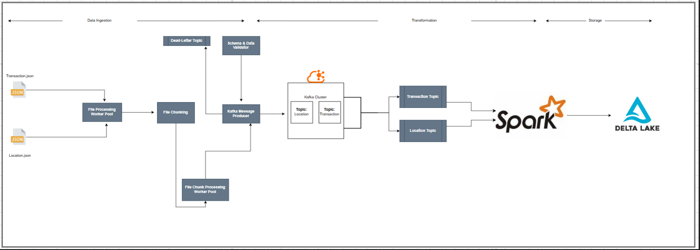

#Kafka Data Processing with Spark and Delta Lake
This project demonstrates how to consume data from Kafka topics (LocationTopic and TransactionTopic), transform it using Apache Spark, and store it in Delta Lake in Parquet format. The processed data is then queried for analytics and insights

##Table of Contents
[Project Overview] Project Overview
[Features] Features
[Technologies Used] Technologies Used
[Architecture] Architecture
[Setup and Installation] Setup and Installation
[Usage] Usage
[Folder Structure] Folder Structure
[Sample Queries] Sample Queries
[Contributing] Contributing

##Project Overview
This project ingests streaming data from two Kafka topics:

LocationTopic: Contains location information (e.g., airport codes, country names, and regions).

TransactionTopic: Contains transaction details (e.g., itineraries, passenger counts, and segments).

##Workflow
1. Data Ingestion: Apache Spark consumes data from Kafka topics.
2. Transformations: The data undergoes transformations such as schema validation and flattening.
3. Storage: Processed data is stored in Delta Lake in Parquet format.
4. Querying: The stored data is queried for insights using SQL.

##Features
1. Real-time data processing using Spark Structured Streaming.
2. Data transformations including schema validation and enrichment.
3. Storage of processed data in Delta Lake in Parquet format.
4. Queryable storage for analytics and reporting.

##Technologies Used
1. Apache Kafka: For streaming data.
2. Apache Spark: For data processing and transformation.
3. Delta Lake: For efficient storage and querying.
4. Python: Core programming language.
5. Parquet: Format for efficient and compressed data storage.
6. Docker: Containerized deployment.

#Architecture



#Setup and Installation
Prerequisites
1. Python (>= 3.8)
2. Apache Kafka (set up locally or in Docker)
3. Apache Spark (configured for Kafka integration)
4. Delta Lake support for Spark
5. Pip for Python package management

#Installation
1. Clone the repository:
```
git clone https://github.com/your-username/your-repo-name.git
cd your-repo-name
```

2. Install Python dependencies
```
pip install -r requirements.txt
```

3. Start Kafka:
```
If installed locally, start Zookeeper and Kafka brokers
```

4. Update configuration in config.yaml:
```
Kafka broker addresses.
Delta Lake storage paths.
Kafka topics (LocationTopic, TransactionTopic).
```

#Usage

1. Running the Spark Job
Start the Spark job to process Kafka streams:

```
python app/spark_job/stream_kafka.py
```

2. Monitor Kafka topics for incoming data (optional):

```kafka-console-consumer.sh --bootstrap-server localhost:9092 --topic Location --from-beginning
kafka-console-consumer.sh --bootstrap-server localhost:9092 --topic Transaction --from-beginning
```

3. Verify processed data in Delta Lake:

```
Check the output directory specified in config.yaml.
```

4. Folder Structure
```
project/
├── app/
│   ├── __init__.py
│   ├── kafka_to_delta.py         # Logic for consuming and storing Kafka data
│   ├── query_definitions.py      # Query logic for insights
│   ├── spark_job/
│   │   ├── stream_kafka.py       # Entry point for Spark job
│   │                               # Data transformation logic
├── schemas/
│   ├── Locations.json             # Sample Location dataset
│   ├── Transactions.json
 -  utils/
│   ├── __init__.py             # Sample Location dataset
│   ├── kafka_to_delta.py
    ├─ query_definations.py
    ├─schema_validator.py
├── config.yaml                   # Kafka and Delta Lake configurations
├── requirements.txt              # Python dependencies
├── README.md                     # Project documentation
```

#Sample Queries

1. Originating Country with Most Transactions
```

SELECT OriginCountry, COUNT(*) as TransactionCount
FROM transaction_data
GROUP BY OriginCountry
ORDER BY TransactionCount DESC
LIMIT 1;
```

2. Domestic vs International Transactions
Query to find the split between domestic and international transactions:

```
SELECT 
    CASE 
        WHEN OriginCountry = DestinationCountry THEN 'Domestic'
        ELSE 'International'
    END AS TransactionType,
    COUNT(*) AS Count
FROM transaction_data
GROUP BY TransactionType;
```


